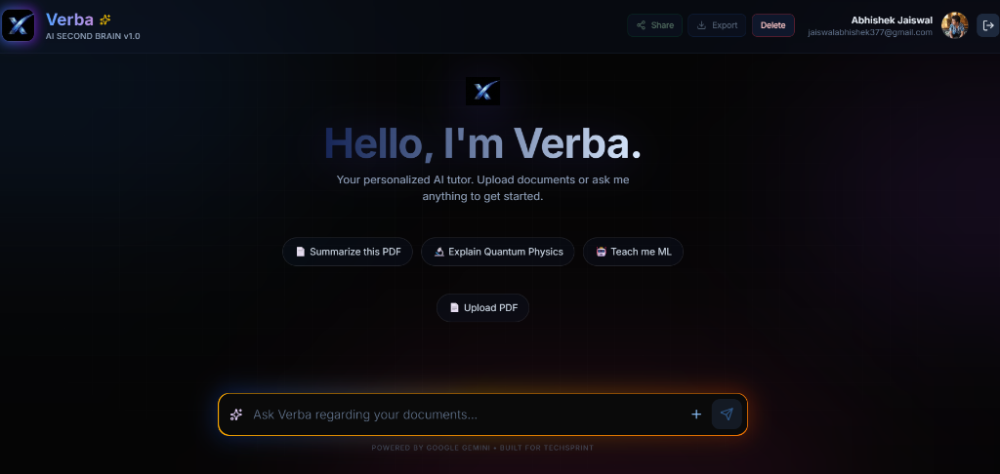
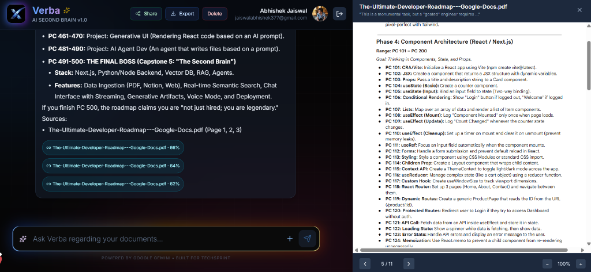
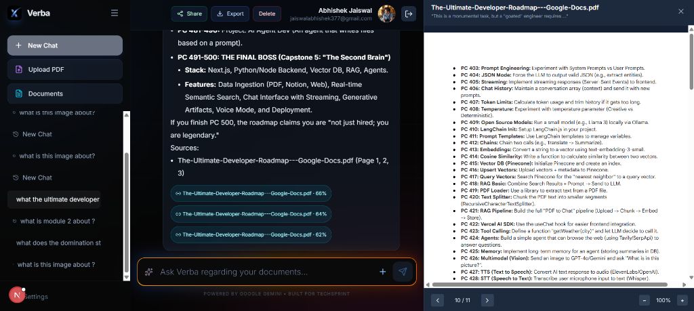
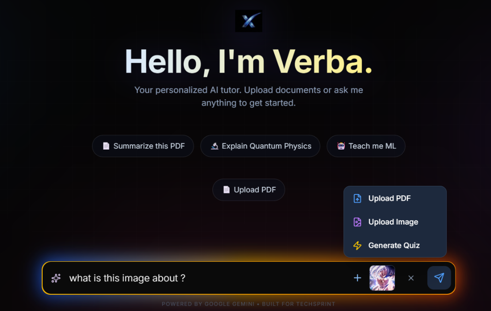
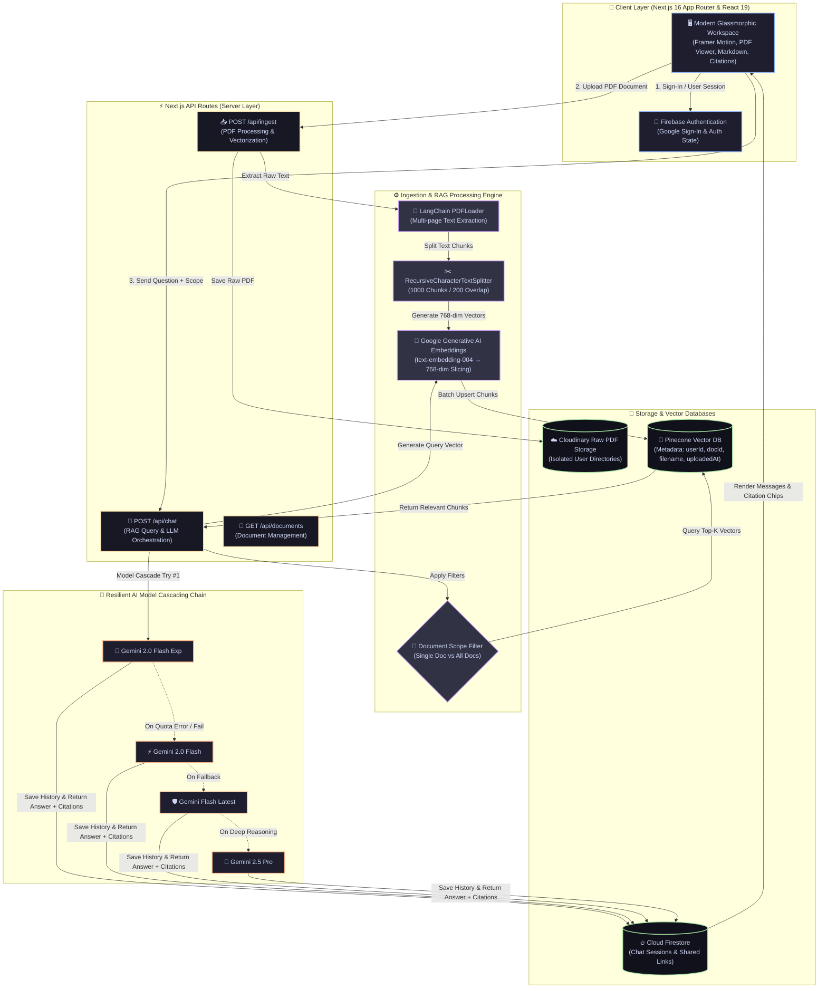

<div align="center">

  

  # 🎯 VERBA — Next-Gen AI Second Brain & RAG Platform

  > **"Receipts-first AI knowledge assistant for instant document intelligence, multi-file retrieval, and page-level verifiable citations."**

  [](https://nextjs.org/)
  [](https://react.dev/)
  [](https://www.typescriptlang.org/)
  [](https://tailwindcss.com/)
  [](https://www.pinecone.io/)
  [](https://ai.google.dev/)
  [](https://firebase.google.com/)
  [](https://cloudinary.com/)

</div>

---

## 📸 Interface & Dashboard Showcase

<div align="center">
  <h3>🖥️ Main Application Workspace</h3>
  
  <p><em>Verba AI Second Brain Workspace — Featuring Dark-Mode Glassmorphism, Quick Prompts, PDF Ingestion, and Grounded Context Input.</em></p>
  <br/>

  <h3>📄 Page-Level RAG Citations & Integrated PDF Inspector</h3>
  
  <p><em>Exact chunk grounding with page-level similarity scores & direct slide-out PDF inspector.</em></p>
  <br/>

  <h3>📂 Session Management Sidebar & Deep Document Navigation</h3>
  
  <p><em>Multi-session chat history sidebar paired with side-by-side document parsing.</em></p>
  <br/>

  <h3>🖼️ Multimodal Vision Processing & Action Tool Menu</h3>
  
  <p><em>Multimodal image understanding with Gemini Vision + Quick PDF / Image / Quiz action dropdown.</em></p>
</div>

---

## 📋 Table of Contents

- [Overview](#-overview)
- [Interface & Dashboard Showcase](#-interface--dashboard-showcase)
- [Key Features & Capabilities](#-key-features--capabilities)
- [System Architecture](#-system-architecture)
- [Technology Stack](#-technology-stack)
- [Deep Dive: RAG Pipeline & Resilience](#-deep-dive-rag-pipeline--resilience)
- [API Reference](#-api-reference)
- [Data Models & Schemas](#-data-models--schemas)
- [Getting Started & Local Setup](#-getting-started--local-setup)
- [Engineering Highlights](#-engineering-highlights)
- [Roadmap & Future Enhancements](#-roadmap--future-enhancements)
- [License](#-license)

---

## 📋 Overview

**Verba** is an advanced, production-grade **Retrieval-Augmented Generation (RAG)** knowledge engine designed to help students, researchers, and technical professionals turn passive PDF libraries into interactive, queryable intelligence bases.

Unlike standard LLM chatbots that suffer from hallucinations or unverified summaries, Verba operates on a **receipts-first paradigm**: every answer is backed by exact text chunks and page-level PDF citations that can be inspected instantly inside an integrated PDF viewer.

---

## ✨ Key Features & Capabilities

### 1. 🎨 Modern Glassmorphic Workspace
- **Hero & Landing Interface:** Built with dark-mode glassmorphism (`#050505`), animated aurora gradients, vertical beam spotlights, and interactive feature cards.
- **Interactive Chat Workspace:** Fluid, responsive chat canvas featuring syntax-highlighted code blocks, LaTeX markdown rendering, and animated loading indicators powered by Framer Motion.

### 2. 📄 Multi-Document PDF Ingestion
- **Automated Text Extraction:** Uses LangChain's `PDFLoader` and `pdf-parse` to convert dense multi-page PDFs into structured raw text.
- **Smart Text Chunking:** Employs `RecursiveCharacterTextSplitter` configured for optimal chunk sizes (1000 characters with 200-character overlaps) to preserve contextual boundaries across paragraphs.
- **Cloudinary Storage:** Securely uploads raw PDFs to Cloudinary under isolated user directories for reliable cloud retrieval.

### 3. 🎯 Flexible Document Scope Control
- **Single Document Mode:** Restricts vector similarity queries strictly to the currently loaded PDF using `docId` metadata filters.
- **All Documents Mode:** Expands RAG retrieval across the user's entire document collection stored in Pinecone to perform cross-file synthesis.

### 4. 📌 Verifiable Page-Level Citations & Slide-In PDF Viewer
- **Interactive Citation Chips:** Each AI response attaches clickable citation tags displaying the target document name, page number, and similarity score.
- **Embedded PDF Inspector:** Clicking a citation slides out a 600px PDF viewing panel powered by `react-pdf` (`pdfjs-dist`), jumping directly to the cited page with full text highlighting.

### 5. 🧠 Multi-Model Fallback Chain
- **Zero-Downtime Resilience:** Automatically cascades requests through a fallback sequence of Gemini models (`gemini-2.0-flash-exp`, `gemini-2.0-flash`, `gemini-flash-latest`, `gemini-2.5-pro`) if rate limits or quota errors occur.

### 6. 📝 Export & Sharing Tools
- **Word Document (.docx) Export:** Export full study sessions into professionally formatted Word documents with citations retained using `docx` and `file-saver`.
- **Public Chat Sharing:** Generate shareable, view-only links stored in Firestore (`/shared/[shareId]`) with automatic view-counter tracking.

### 7. 📂 Document Management Dashboard
- Dedicated `/documents` dashboard allowing users to inspect uploaded files, view chunk counts, search by document title, and delete documents with cascade cleanup.

---

## 🏗️ System Architecture

The following diagram illustrates the complete data lifecycle—from file ingestion to vector indexation and RAG retrieval.



---

## 🛠️ Technology Stack

| Domain | Technology | Description |
| :--- | :--- | :--- |
| **Frontend Framework** | **Next.js 16.1.1 (App Router)** | Modern SSR/SSG React framework with Server Components and API Routes |
| **UI Library** | **React 19.2.3** | Core rendering engine utilizing modern hooks and state handling |
| **Language** | **TypeScript 5.0** | End-to-end static type safety across API payload types and components |
| **Styling & Motion** | **Tailwind CSS 4.0 & Framer Motion** | Utility-first CSS framework combined with spring physics micro-animations |
| **Vector Database** | **Pinecone DB** | Fully managed vector database hosting 768-dimensional document vectors |
| **AI Models & Embeddings**| **Google Gemini API** | Embeddings via `text-embedding-004`; Generation via `gemini-2.0-flash` & `gemini-2.5-pro` |
| **RAG Orchestration** | **LangChain JS/TS** | Orchestrates chunk splitting, loader wrappers, and vector store bindings |
| **Database & Auth** | **Firebase Auth & Firestore** | Google OAuth authentication, session persistence, and shared chat state |
| **Cloud Storage** | **Cloudinary** | Raw file storage for original PDF documents |
| **Document Processing** | **`pdf-parse`, `docx`, `react-pdf`** | Multi-page text extraction, Word document generation, and client PDF rendering |

---

## ⚙️ Deep Dive: RAG Pipeline & Resilience

### 1. Vector Dimension Alignment
Google's `text-embedding-004` model generates high-dimensional embeddings. To ensure optimal performance and seamless integration with free-tier vector indexes, Verba wraps the embedding response to perform **768-dimensional slicing**:

```typescript
const embeddings = {
  embedDocuments: async (texts: string[]) => {
    const fullEmbeddings = await baseEmbeddings.embedDocuments(texts);
    return fullEmbeddings.map(emb => emb.slice(0, 768));
  },
  embedQuery: async (text: string) => {
    const fullEmbedding = await baseEmbeddings.embedQuery(text);
    return fullEmbedding.slice(0, 768);
  },
};
```

### 2. Ingestion Batching & Rate Limit Mitigation
To avoid hitting provider rate limits during document ingestion, raw documents are split into batches of 10 chunks with mandatory 2-second delays between embedding writes:

```typescript
const batchSize = 10;
for (let i = 0; i < docs.length; i += batchSize) {
  const batch = docs.slice(i, i + batchSize);
  await PineconeStore.fromDocuments(batch, embeddings, { pineconeIndex });
  if (i + batchSize < docs.length) {
    await new Promise(resolve => setTimeout(resolve, 2000));
  }
}
```

### 3. Multi-Tenant Data Isolation
Every vector chunk pushed to Pinecone includes explicit security metadata (`userId` and `docId`). Retrieval queries enforce boolean filter expressions to guarantee users can only query their authorized vectors:

```json
{
  "userId": "user_2x9A...",
  "docId": "doc_8f7b...",
  "filename": "Quantum_Mechanics_Ch1.pdf",
  "uploadedAt": "2026-08-06T14:00:00Z"
}
```

---

## 🔌 API Reference

### 1. Ingest PDF Document
- **Endpoint:** `POST /api/ingest`
- **Content-Type:** `multipart/form-data`
- **Request Body:**
  - `file`: PDF file blob
  - `userId`: String (Firebase UID)
- **Response `200 OK`:**
```json
{
  "success": true,
  "message": "File embedded successfully!",
  "chunks": 42,
  "characters": 38400,
  "docId": "doc_8f7b3a9c2e1041b6",
  "filename": "Quantum_Mechanics_Ch1.pdf"
}
```

### 2. Execute RAG Chat Query
- **Endpoint:** `POST /api/chat`
- **Content-Type:** `application/json`
- **Request Payload:**
```json
{
  "message": "Explain Schrödinger's wave equation based on the text.",
  "history": [],
  "userId": "user_2x9A...",
  "docId": "doc_8f7b3a9c2e1041b6",
  "searchAllDocs": false,
  "model": "gemini-2.0-flash"
}
```
- **Response `200 OK`:**
```json
{
  "text": "According to Chapter 1 (page 14), Schrödinger's wave equation describes...",
  "citations": [
    {
      "filename": "Quantum_Mechanics_Ch1.pdf",
      "page": 14,
      "preview": "The time-dependent Schrödinger equation is given by...",
      "score": 0.892
    }
  ],
  "modelUsed": "gemini-2.0-flash"
}
```

### 3. Fetch User Documents
- **Endpoint:** `GET /api/documents?userId={userId}`
- **Response `200 OK`:**
```json
{
  "documents": [
    {
      "docId": "doc_8f7b3a9c2e1041b6",
      "filename": "Quantum_Mechanics_Ch1.pdf",
      "chunks": 42,
      "uploadedAt": "2026-08-06T14:00:00Z"
    }
  ]
}
```

---

## 🗄️ Data Models & Schemas

### Cloud Firestore Collections

#### `chats` Collection (`/chats/{sessionId}`)
```typescript
interface ChatSession {
  sessionId: string;
  userId: string;
  title: string;
  createdAt: Timestamp;
  updatedAt: Timestamp;
  messages: Array<{
    id: string;
    role: "user" | "model";
    text: string;
    citations?: Citation[];
    timestamp: string;
  }>;
}
```

#### `sharedChats` Collection (`/sharedChats/{shareId}`)
```typescript
interface SharedChat {
  shareId: string;
  title: string;
  messages: Array<{ role: string; text: string; citations?: Citation[] }>;
  createdAt: string;
  views: number;
  authorName: string;
}
```

---

## 🚀 Getting Started & Local Setup

### Prerequisites
- **Node.js**: `v18.x` or higher
- **Package Manager**: `npm` (v9+) or `pnpm`
- **Service Accounts**:
  - [Google Gemini API Key](https://aistudio.google.com/)
  - [Pinecone Vector DB Account](https://www.pinecone.io/)
  - [Firebase Project](https://console.firebase.google.com/)
  - [Cloudinary Account](https://cloudinary.com/)

### Step-by-Step Installation

1. **Clone the Repository:**
   ```bash
   git clone https://github.com/your-username/second-brain.git
   cd second-brain
   ```

2. **Install Dependencies:**
   ```bash
   npm install
   ```

3. **Configure Environment Variables:**
   Create a `.env.local` file in the project root and populate the following keys:

   ```env
   # Google Gemini API Key
   GEMINI_API_KEY=AIzaSy...

   # Pinecone Vector DB
   PINECONE_API_KEY=pcsk_...
   PINECONE_INDEX_NAME=second-brain

   # Firebase Web Configuration
   NEXT_PUBLIC_FIREBASE_API_KEY=AIzaSy...
   NEXT_PUBLIC_FIREBASE_AUTH_DOMAIN=your-app.firebaseapp.com
   NEXT_PUBLIC_FIREBASE_PROJECT_ID=your-app-id
   NEXT_PUBLIC_FIREBASE_STORAGE_BUCKET=your-app.appspot.com
   NEXT_PUBLIC_FIREBASE_MESSAGING_SENDER_ID=123456789
   NEXT_PUBLIC_FIREBASE_APP_ID=1:123456789:web:...

   # Cloudinary Credentials
   CLOUDINARY_CLOUD_NAME=your_cloud_name
   CLOUDINARY_API_KEY=123456789
   CLOUDINARY_API_SECRET=your_secret
   ```

4. **Launch Local Development Server:**
   ```bash
   npm run dev
   ```

5. **Access Application:**
   Open [http://localhost:3000](http://localhost:3000) in your web browser.

---

## 🌟 Engineering Highlights

1. **Strict Context Grounding Prompting:** System prompts force the LLM to strictly evaluate retrieved context chunks before synthesizing answers, preventing ungrounded assertions.
2. **Resilient Network Handling:** Ingest and chat services return granular HTTP error codes (`429 Quota Exceeded`, `503 Service Unavailable`, `400 Invalid File`) to allow seamless UI toast reporting.
3. **Optimized Client State Management:** Uses React 19 optimistic updates and local storage fallback for rapid conversation toggling without interface flicker.

---

## 🛣️ Roadmap & Future Enhancements

- [ ] **Hybrid Retrieval (BM25 + Dense Vectors):** Combine keyword-based BM25 sparse search with dense Pinecone vector embeddings for higher precision on technical jargon.
- [ ] **Cohere Reranking Integration:** Add a second-stage cross-encoder reranker to improve Top-K retrieval precision before LLM prompt assembly.
- [ ] **Multi-Modal Image & Diagram Parsing:** Enable Gemini 2.0 Flash Vision to process images, tables, and architectural diagrams directly inside PDF documents.
- [ ] **Automated CI/CD Test Suite:** Implement End-to-End Playwright test flows and Vitest unit testing in GitHub Actions.

---

## 📄 License

This project is licensed under the **ISC License**. Free to use and modify for educational and personal projects.
